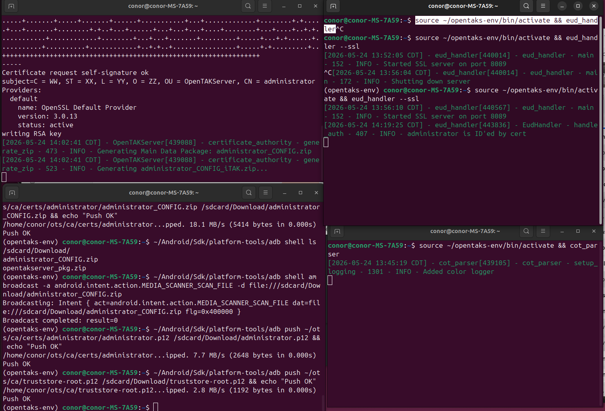
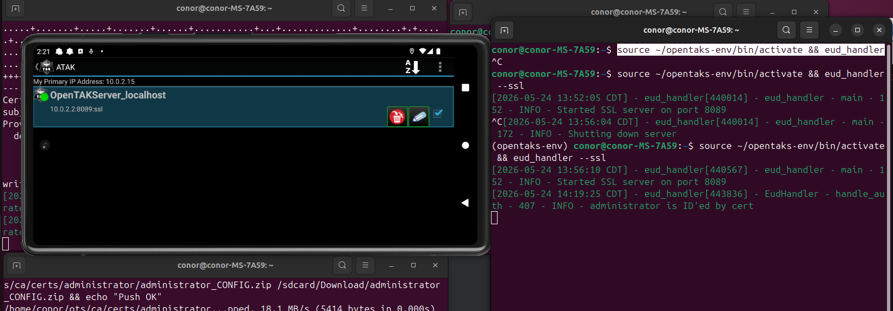
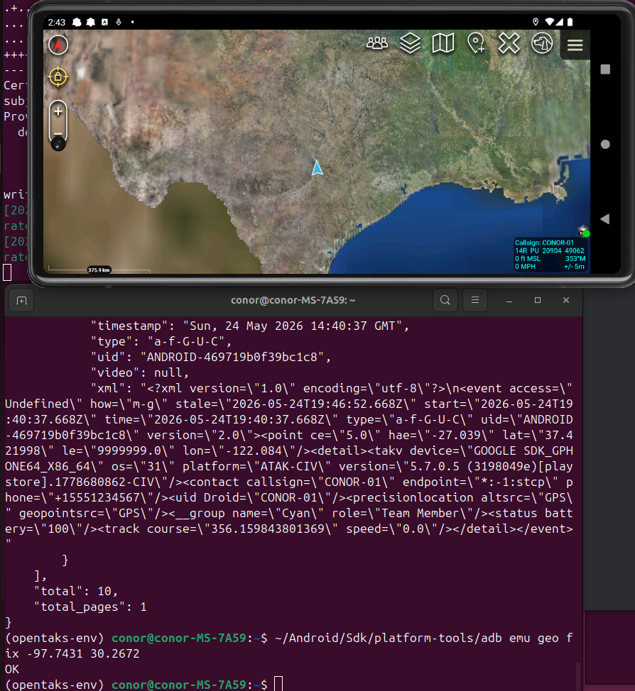

# Project 2: Self-Hosted TAK Server Infrastructure with ATAK Integration

**Author:** Conor Yarbrough  
**Stack:** OpenTAKServer 1.7.11 · Ubuntu 24.04 · ATAK 5.7.0.5 · Android Studio Emulator · Python 3.11  
**Companion Project:** [SRT Protocol Resilience Study](https://github.com/theconn47/srt-protocol-resilience-study)

---

## Overview

This project demonstrates the deployment of a self-hosted Tactical Awareness Kit (TAK) server infrastructure from scratch on a bare Ubuntu machine, including full ATAK client connectivity over mutual TLS (mTLS), certificate-based device authentication, and bidirectional Cursor-on-Target (CoT) data flow.

The architecture mirrors what defense and intelligence contractors such as Anduril, Viasat, Silvus Technologies, and L3Harris deploy in field environments — a persistent TAK server receiving and routing CoT position reports from connected ATAK endpoints.

**Key outcomes:**
- OpenTAKServer running in production mode with PostgreSQL backend
- ATAK 5.7.0.5 client authenticated via client certificate over SSL (port 8089)
- Live CoT position data flowing from ATAK to OTS and confirmed in the database
- Emulator GPS spoofed to Austin, TX — position rendered on ATAK tactical map
- CoT injection script demonstrated from Ubuntu host to OTS

---

## Screenshots

### Full Stack Running — Three-Process Architecture


### ATAK Connected to OTS — SSL + Certificate Authentication


### CONOR-01 Position Report — Austin, Texas


---

## Architecture

```
┌─────────────────────────────────────────────┐
│              Ubuntu 24.04 Host              │
│              192.168.1.252                  │
│                                             │
│  ┌──────────────┐    ┌──────────────────┐   │
│  │ opentakserver│    │   cot_parser     │   │
│  │ (port 8082)  │◄──►│  (RabbitMQ)      │   │
│  └──────────────┘    └──────────────────┘   │
│                                             │
│  ┌──────────────┐    ┌──────────────────┐   │
│  │  eud_handler │    │   PostgreSQL     │   │
│  │  --ssl       │    │   RabbitMQ       │   │
│  │ (port 8089)  │    │   nginx          │   │
│  └──────┬───────┘    └──────────────────┘   │
└─────────┼───────────────────────────────────┘
          │ mTLS / SSL CoT (port 8089)
          │
┌─────────▼───────────────────────────────────┐
│         Android Studio Emulator             │
│         Pixel 6 / Android 12               │
│         ATAK 5.7.0.5 (Play Store build)    │
│         Emulator host alias: 10.0.2.2      │
└─────────────────────────────────────────────┘
```

**Critical insight:** OpenTAKServer is not a single process. It requires three separate processes running simultaneously:

| Process | Command | Purpose |
|---|---|---|
| Main server | `opentakserver` | Web UI, REST API, certificate enrollment, PostgreSQL |
| CoT parser | `cot_parser` | RabbitMQ message processing, CoT routing |
| EUD handler | `eud_handler --ssl` | TCP/SSL listener for ATAK device connections (port 8089) |

This is not documented clearly in the OTS README and was the primary source of troubleshooting in this deployment.

---

## Prerequisites

- Ubuntu 24.04 (24GB RAM recommended)
- Python 3.11
- PostgreSQL
- RabbitMQ
- Android Studio with a Pixel 6 emulator (API 31)
- ATAK 5.7.0.5 APK (Play Store build)
- ADB (`~/Android/Sdk/platform-tools/adb`)

---

## Installation

### 1. Create virtual environment and install OTS

```bash
python3 -m venv ~/opentaks-env
source ~/opentaks-env/bin/activate
pip install opentakserver
```

### 2. Configure PostgreSQL

```bash
sudo -u postgres psql -c "CREATE USER ots WITH PASSWORD 'POSTGRESQL_PASSWORD';"
sudo -u postgres psql -c "CREATE DATABASE ots OWNER ots;"
```

### 3. First run (generates certs and config)

```bash
source ~/opentaks-env/bin/activate && opentakserver
```

OTS will generate its CA, config file at `~/ots/config.yml`, and certificates at `~/ots/ca/`.

---

## Critical Configuration Fixes

Several default config values must be changed before ATAK can connect. Edit `~/ots/config.yml`:

### Fix 1: Listener address (default blocks external connections)

```yaml
# WRONG (default) — binds only to loopback
OTS_LISTENER_ADDRESS: 127.0.0.1

# CORRECT — binds to all interfaces
OTS_LISTENER_ADDRESS: 0.0.0.0
```

### Fix 2: IP whitelist (default blocks all non-localhost traffic)

```yaml
# WRONG (default) — blocks the Android emulator's traffic
OTS_IP_WHITELIST:
- 127.0.0.1

# CORRECT — open to allow emulator connections
OTS_IP_WHITELIST: []
```

### Fix 3: Listener port conflict

OTS defaults to port 8081 for its internal listener. On some systems this conflicts with other services. Change it:

```yaml
OTS_LISTENER_PORT: 8082
```

### Fix 4: Missing ca.pem symlink

OTS generates `ca-trusted.pem` but `eud_handler` looks for `ca.pem`. Create the symlink:

```bash
ln -s ~/ots/ca/ca-trusted.pem ~/ots/ca/ca.pem
```

If the symlink already exists, skip this step.

---

## Starting the Server (correct order)

Open three terminal windows and run one process per terminal:

**Terminal 1 — Main OTS server:**
```bash
source ~/opentaks-env/bin/activate && opentakserver
```

**Terminal 2 — CoT parser:**
```bash
source ~/opentaks-env/bin/activate && cot_parser
```

**Terminal 3 — EUD handler (SSL):**
```bash
source ~/opentaks-env/bin/activate && eud_handler --ssl
```

Verify all ports are listening:
```bash
ss -tlnp | grep -E '8082|8089'
```

Expected output:
```
LISTEN 0  128  0.0.0.0:8082  0.0.0.0:*  users:(("opentakserver",...))
LISTEN 0    5  0.0.0.0:8089  0.0.0.0:*  users:(("eud_handler",...))
```

---

## Enrolling a Client Certificate

OTS uses mTLS — ATAK must present a valid client certificate signed by the OTS CA. Enroll one via the REST API:

```bash
# Get session token
curl -sk -X POST "http://localhost:8082/api/login" \
  -H "Content-Type: application/json" \
  -d '{"username": "administrator", "password": "password"}' \
  -c /tmp/ots_cookies.txt

# Extract CSRF token from response, then enroll cert
TOKEN=$(curl -sk -X POST "http://localhost:8082/api/login" \
  -H "Content-Type: application/json" \
  -d '{"username": "administrator", "password": "password"}' \
  -c /tmp/ots_cookies.txt | python3 -c \
  "import sys,json; d=json.load(sys.stdin); print(d.get('response',{}).get('csrf_token',''))")

curl -sk -X POST "http://localhost:8082/api/certificate" \
  -H "Content-Type: application/json" \
  -H "X-CSRF-TOKEN: $TOKEN" \
  -b /tmp/ots_cookies.txt \
  -d '{"username": "administrator", "callsign": "CONOR-01"}'
```

OTS generates two files:
- `~/ots/ca/certs/administrator/administrator_CONFIG.zip` — full data package
- `~/ots/ca/certs/administrator/administrator.p12` — client cert only

**Note:** The default admin username is `administrator`, not `admin`.

---

## Connecting ATAK

### Push cert files to emulator

```bash
# Push client cert
~/Android/Sdk/platform-tools/adb push \
  ~/ots/ca/certs/administrator/administrator.p12 \
  /sdcard/Download/administrator.p12

# Push CA truststore
~/Android/Sdk/platform-tools/adb push \
  ~/ots/ca/truststore-root.p12 \
  /sdcard/Download/truststore-root.p12
```

### Configure server in ATAK 5.7.0.5

**Important:** In ATAK 5.7.0.5 (Play Store build), TAK Servers is **not** found directly under Network Preferences. The path is:

`Settings → Network Preferences → Network Preferences (first submenu item) → TAK Servers`

To add the server manually:
1. Navigate to **Network Preferences → Network Preferences → TAK Servers**
2. Tap **+** to add a new server
3. Enter:
   - **Address:** `10.0.2.2` (Android emulator alias for host machine)
   - **Port:** `8089`
   - **Protocol:** `SSL`
4. Uncheck **Use default SSL/TLS Certificates**
5. Tap **Import Client Certificate** → navigate to `/sdcard/Download/` → select `administrator.p12`
   - Password: `atakatak`
6. Tap **Import Trust Store** → select `truststore-root.p12`
   - Password: `atakatak`
7. Tap **OK**

Successful connection is confirmed in the `eud_handler` terminal:
```
INFO - administrator is ID'ed by cert
```

---

## Verifying CoT Data Flow

### Check ATAK position in OTS database

```bash
curl -sk "http://localhost:8082/api/cot" \
  -b /tmp/ots_cookies.txt | python3 -m json.tool | grep -A3 '"callsign"'
```

### Spoof emulator GPS to Austin, TX

```bash
~/Android/Sdk/platform-tools/adb emu geo fix -97.7431 30.2672
```

ATAK will update its position report and the marker will appear over Central Texas on the tactical map.

### Inject a CoT event from the host

```python
import socket, ssl

cot = """<?xml version="1.0" encoding="UTF-8"?>
<event version="2.0" uid="austin-base-001" type="a-f-G-U-C"
  time="2026-05-24T19:30:00Z" start="2026-05-24T19:30:00Z"
  stale="2026-05-25T19:30:00Z" how="m-g">
  <point lat="30.2672" lon="-97.7431" hae="150" ce="10" le="10"/>
  <detail>
    <contact callsign="AUSTIN-BASE"/>
    <uid Droid="AUSTIN-BASE"/>
  </detail>
</event>"""

context = ssl.SSLContext(ssl.PROTOCOL_TLS_CLIENT)
context.check_hostname = False
context.verify_mode = ssl.CERT_NONE

with socket.create_connection(("127.0.0.1", 8089)) as sock:
    with context.wrap_socket(sock) as ssock:
        ssock.sendall(cot.encode())
        print("CoT sent!")
```

---

## Troubleshooting Reference

### OTS crashes with `OSError: [Errno 98] Address already in use`

A previous OTS instance is still running. Kill it by port:

```bash
sudo fuser -k 8082/tcp
sudo fuser -k 8089/tcp
pkill -9 -f opentakserver
```

### Port 8443 never opens

Port 8443 is **not** opened by the `opentakserver` process. It is opened by `eud_handler --ssl` on port 8089. The config value `OTS_MARTI_HTTPS_PORT: 8443` is a label used in cert generation and data packages, not the actual listening port when running standalone without nginx.

### ATAK Quick Connect always fails

Quick Connect does not support client certificates. It will always fail against OTS because OTS requires `ssl.CERT_REQUIRED` (mTLS). You must import the client cert and truststore manually before connecting.

### ATAK file browser shows empty Download folder

The ATAK file browser filters by file type. It will not show `.zip` files in the Import Client Certificate dialog — only `.p12` files. Push the `.p12` directly rather than the data package zip.

### `administrator_CONFIG.zip` data package uses `localhost` as server address

The auto-generated data package encodes `localhost` as the server hostname, which resolves to the emulator itself (not the host). After importing the package, edit the server entry and change the address to `10.0.2.2`.

### Authentication fails with username `admin`

The default admin account created by OTS is `administrator`, not `admin`. Use `administrator` for all API calls and ATAK login prompts.

---

## Key Takeaways for Defense Tech Context

This lab replicates the core infrastructure pattern used in deployed tactical networks:

- **mTLS device authentication** — every ATAK endpoint must present a cert signed by the server's CA, preventing unauthorized devices from joining the network
- **CoT as the data plane** — Cursor-on-Target XML is the lingua franca of NATO-adjacent ISR systems; this lab demonstrates injection, routing, and display of CoT events
- **Self-hosted PKI** — OTS manages its own certificate authority, mirroring the zero-trust enrollment process used in PACE plans and disconnected/denied environments
- **Multi-process architecture** — real TAK server deployments (TAK Server, WinTAK Server) similarly separate the web tier, message broker, and CoT streaming server into distinct processes

---

## Related Work

- [Project 1: SRT vs RTMP Protocol Resilience Benchmark](https://github.com/theconn47/srt-protocol-resilience-study) — quantified SRT's superiority under packet loss conditions representative of contested RF environments
